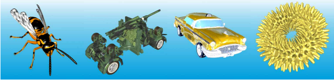
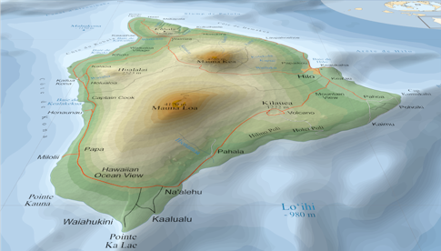
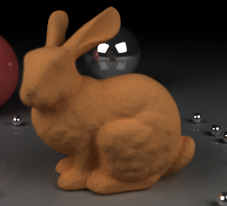
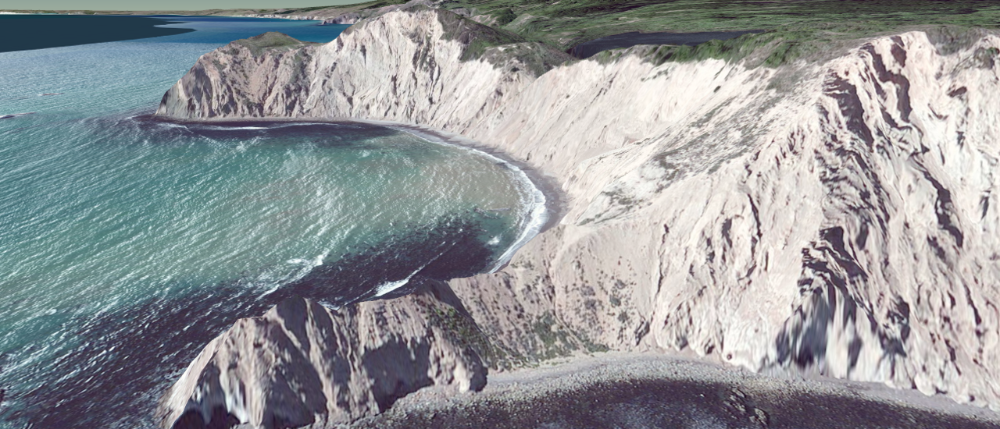

# Final Project

[CIS 565](https://cis565-fall-2015.github.io/): GPU Programming and Architecture

University of Pennsylvania

The final project gives you an opportunity to embark on a large GPU programming endeavor of your choice.  You are free to select an area in graphics, GPU computing, or both.  You can reproduce the results of recent research, add a novel extension to existing work, fulfill a real need in the community, or implement something completely original.

Expect this to be 2-3x more work than the hardest project this semester.  The best projects will require a time commitment of at least 100 hours per student.  It will be worth it.

## Guidelines

* Form teams of two.  Each team member will receive the same grade.  Teams of one or three will be considered.  Teams of three will be expected to build something truly amazing like [this](https://github.com/ishaan13/PhotonMapper).
* Use GitHub.  We encourage, but do not require, you to develop in a public repo as open source.
* Programming language, graphics and compute APIs, and target platforms are up to you.
* You are allowed to use existing code and libraries.  These should be prominently credited and your code should be easily identifiable.

## Project Ideas

### Alternative Rendering Pipelines

Use CUDA or compute shaders to build a custom or hybrid rendering pipeline, e.g., instead of creating a rasterization pipeline for triangles, create a graphics pipeline optimizations for [points](http://graphics.ucsd.edu/~matthias/Papers/Surfels.pdf), [voxels](https://research.nvidia.com/publication/voxelpipe-programmable-pipeline-3d-voxelization), or [vectors](http://w3.impa.br/~diego/projects/GanEtAl14/).

Surfels: Surface Elements as Rendering Primitives by Hanspeter Pfister et al.

VoxelPipe: A Programmable Pipeline for 3D Voxelization by Jacopo Pantaleoni.

Massively-Parallel Vector Graphics by Francisco Ganacim.

### High-Quality Server-Side Rendering

Use WebGL on the client with perhaps low-resolution geometry and optimized shaders to view a scene.  When the camera stops moving, render a high-quality image server-side using a GPU path tracer (from our course) or Photon mapper.

Image by [Zakiuddin Shehzan Mohammed](http://www.colorseffectscode.com/Projects/FinalProject.html).

### Distributed Rendering

In general, where is the client/server split?
* All server, compress and stream?
* Create g-buffer server-side, light accumulate client-side?
* Temporal coherence.  What can we compute server-side and use for many frames?  Cube maps, etc.

Image from http://shield.nvidia.com/

### Massive Terrain AO or Shadows

Terrain AO can be precomputed in a massively parallel fashion: each vertex in parallel, each ray in parallel, consider local area only, etc.

Terrain shadows can be implemented with [Horizon Mapping](https://web.archive.org/web/20150915130939/http://research.microsoft.com/en-us/um/people/cohen/bs.pdf).  The horizon map for each point can be precomputed in parallel.

### glTF

glTF, the GL Transmission Format (glTF), is a new runtime asset delivery format for WebGL.  It needs an ecosystem of tools, documentation, and extensions.  Consider implementing a minimal WebGL renderer for glTF assets or doing a detailed size/performance analysis of glTF compared to other 3D model formats.  See [these ideas](https://github.com/KhronosGroup/glTF/issues/456).

Disclosure: I am one of the glTF spec editors.

### WebGL Samples

WebGL 2 will bring many great features: uniform buffers, transform feedback, instancing, etc.  The developer community will need simple examples to get them started.  Port a subset of the fantastic and widely used [OpenGL Samples Pack](http://www.g-truc.net/project-0026.html) by Christophe Riccio to JavaScript and WebGL.

### WebGL vs. OpenGL ES Mobile Power Usage

On mobile, how does the power usage of JavaScript/WebGL compare to C++/OpenGL ES 2 (or Java/ES or Objective C/ES)?  For example, if the same app is developed in WebGL and OpenGL ES, which one drains the battery first - and why?  What type of benchmarks need to be developed, e.g., CPU bound, GPU compute bound, GPU memory bound, etc.?

### WebGL for Graphics Education

Create a tutorial using WebGL that teaches either basic _GPU architecture_ (parallelism, branches, multithreading, SIMD, etc.) or _Tile-Based Architectures_ like those used in mobile GPUs.  For inspiration, see [Making WebGL Dance](http://acko.net/files/fullfrontal/fullfrontal/webglmath/online.html) by Steven Wittens.

### WebGL Shader Profiler

How can we profile shaders? Develop a tool to mouse over a pixel and see the fragment shader's hotspots by modifying the shader over several runs.  Can this be done automatically or does it require user-provided markup?

### Previous Semesters

For inspiration, browse the CIS 565 final projects from previous semesters: [Fall 2014](http://cis565-fall-2014.github.io/studentwork.html), [Fall 2013](http://cis565-fall-2013.github.io/studentwork.html), [Fall 2012](http://cis565-fall-2012.github.io/studentwork.html), [Spring 2012](http://cis565-spring-2012.github.com/studentwork.html), and [Spring 2011](http://www.seas.upenn.edu/~cis565/StudentWork-2011S.htm).

#### Selected Projects

* **Fall 2014**
   * [Bidirectional Path Tracer in CUDA](https://github.com/paula18/Photon-Mapping) by Paula Huelin Merino and Robbie Cassidy
   * [GPU-Accelerated Dynamic Fracture in the Browser with WebCL](https://github.com/kainino0x/cis565final) by Kai Ninomiya and Jiatong He
   * [Uniform grid and kd-tree in CUDA](https://github.com/jeremynewlin/Accel) by Jeremy Newlin and Danny Rerucha
* **Fall 2013**
   * [Surface Mesh Reconstruction from RGBD Images](https://github.com/cboots/RGBD-to-Mesh) by Collin Boots and Dalton Banks
   * [Sparse Voxel Octree](https://github.com/otaku690/SparseVoxelOctree) by Cheng-Tso Lin
   * [Terrain tessellation](https://github.com/mchen15/Gaia) by Mikey Chen and Vimanyu Jain
   * [GPU Photon Mapper](https://github.com/ishaan13/PhotonMapper) by Ishaan Singh, Yingting Xiao, and Xiaoyan Zhu
* **Fall 2012**
   * [Non-photorealistic Rendering](http://gpuprojects.blogspot.com/) by Kong Ma
   * [Procedural Terrain](http://gputerrain.blogspot.com/) by Tiju Thomas
   * [KD Trees on the GPU](http://www.colorseffectscode.com/Projects/FinalProject.html) by Zakiuddin Shehzan Mohammed
* **Spring 2012**
   * [Single Pass Order Independent Transparency](http://gamerendering.blogspot.com/) by Sean Lilley
   * [GPU-Accelerated Logo Detection](http://erickboke.blogspot.com/) by Yu Luo
   * [GPU-Accelerated Simplified General Perturbation No. 4 (SGP4) Model](http://www.matthewahn.com/blog/sgp4-14558-satellites-in-orbit/) by Matthew Ahn
* **Spring 2011**
   * [Fast Pedestrian Recognition on the GPU](http://spevis.blogspot.com/) by Fan Deng
   * [Screen Space Fluid Rendering](http://fastfluids.blogspot.com/) by Terry Kaleas
   * [Deferred Shader with Screen Space Classification](http://smt565.blogspot.com/) by Sean Thomas

### Conferences and Journals

Browse these for ideas galore!

* [Journal of Computer Graphics Techniques](http://jcgt.org/read.html)
* [Advances in Real-Time Rendering](http://advances.realtimerendering.com/) SIGGRAPH courses
* [Ke-Sen Huang's conference pages](http://kesen.realtimerendering.com/) - papers from SIGGRAPH, Eurographics, I3D, and elsewhere
* [Real-Time Rendering Portal](http://www.realtimerendering.com/portal.html) - links to an amazing amount of content
* Books (will bring them into class): GPU Pro series, WebGL Insights, OpenGL Insights, Real-Time Rendering

## Timeline

### **Tuesday 11/10** - Project Pitch

Sign up for a time slot ASAP.

Your project pitch is a 15-minute meeting with Patrick and Kai and a write-up no longer than one page that includes an overview of your approach with specific goals.  First, focus on why there is a need for your project.  Then describe what exactly you are going to do.  In addition to your write-up, provide supplemental figures, images, or videos.

Think of your pitch as if you are trying to get a startup funded, convince your company to start a new project, or responding to a grant.

**Before the meeting**:
* Email your one page pitch and any supplemental material to Patrick and Kai by end of Monday 11/09.

**After the meeting**:
* Push your pitch to a new GitHub repo for your project
* Email the repo link to  cis-565-fall-2015@googlegroups.com 

### **Monday 11/16** - Project Overview Presentation

**In class after the guest lecture**

Your first presentation should be 7-10 minutes long.  Present your work-in-progress after one week of research, design, and development.  Your presentation can include a few slides, videos, screenshots, and demos if possible.  Be sure to
* Demonstrate working code (videos and screenshots are OK; it doesn’t have to be live).
* Provide a roadmap with three milestones (11/23, 11/30, and 12/07), and the final result (12/11).  Set goals for each.

Present as a team.  For a great example, see http://www.youtube.com/watch?v=OTCuYzAw31Y

After class, push your presentation to your GitHub repo

### **Monday 11/23** - Milestone 1

**In class after the guest lecture**

A 5-7 minute presentation on your progress over the past week.  Demonstrate how you reached or exceeded the goals for this milestone.  If you didn't reach them, explain why.

Push your slide to your GitHub repo by end of Monday 11/23.

### **Monday 11/30** - Milestone 2

**In class after the guest lecture**

Same format as Milestone 1.

### **Monday 12/07** - Milestone 3

**In class after the guest lecture**

Same format as Milestone 1.

### **Friday 12/11** - Final Presentation

**5pm, Moore 212**

10-minute final presentation and demo.

By midnight Thursday 12/10:
* Push the following to GitHub
   * Final presentation slides
   * Final code - should be clean, documented, and tested.
* A detailed README.md including:
   * Name of your project
   * Your names and links to your website/LinkedIn/twitter/whatever
   * Choice screenshots including debug views
   * Link to demo if possible.  WebGL demos should include your names and a link back to your github repo.
   * Overview of technique and links to references
   * Link to video
      * Two to four minutes in length to show off your work.  Your video should complement your paper and clarify anything that is difficult to describe in just words and images.  Your video should both make us excited about your work and help us if we were to implement it.
   * Detailed performance analysis
   * Install and build instructions

## Grading

The final project is worth 50% of your final grade.  The breakdown is:

* Project Overview Presentation: 10%
* Milestone 1: 20%
* Milestone 2: 20%
* Milestone 3: 20%
* Final Presentation: 30%
